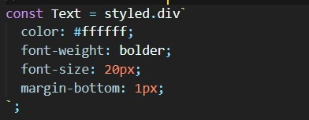
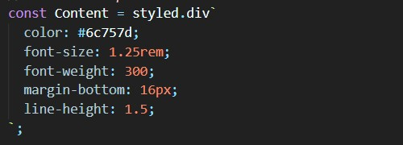

# 전체 실행화면

  

# 설계방법 / 코드설명

## App.js

## 

- GlobalStyle 컴포넌트를 통해 body의 css style을 적용함
- Bar 컴포넌트(상단바), Main 컴포넌트(중앙 박스), ItemBox 컴포넌트(아이템 카드 영역)를 차례로 화면에 나타냄

  

## 1. body 설정 (Global / index.js)

### GlobalStyle / index.js

## 

- margin을 0으로 설정하여 컴포넌트를 만들 때 창의 외곽 공간이 생기지 않도록 함
- body 텍스트의 기본으로 적용될 폰트와 글자 색을 설정함
- 최종적으로 GlobalStyle을 내보내 App.js에서 사용함

  

## 2. 상단바 (Bar/ index.js)

### Bar 구성

  

### 코드설명

- 전체 BarBox 안에 카메라 이모티콘과 'Album' 텍스트를 담고 있는 TextBox를 배치함
- 최종적으로 완성된 Bar 함수 컴포넌트를 App.js로 내보냄
    

- Bar 구성에서도 볼 수 있듯이 전체 상단바 박스를 나타냄
- display와 align-items를 통해 TextBox를 세로축 기준으로 중앙에 배치함
- padding을 주어 박스 내부에 공간을 만듦
    

- Bar 구성에서도 볼 수 있듯이 카메라 아이콘과 Album 텍스트를 포함하고 있는 박스를 나타냄
- align-items를 통해 카메라 아이콘과 'Album' 텍스트를 세로축 기준으로 가운데 정렬함
- '.camera'의 경우 카메라 아이콘의 스타일을 적용시킬 수 있음
- .camera 안에서 아이콘의 크기과 색을 지정해주었으며 margin-right으로 'Album' 텍스트와의 공간을 줌

  

- Bar 구성에서도 볼 수 있듯이 'Album' 텍스트를 나타냄
- 글자 색을 흰색으로 설정하고 글씨를 굵게 만듦
- margin을 아래에 1px 설정함으로써 카메라 아이콘과의 중앙을 맞춤

  

## 3. 중앙 박스 (Main / index.js)

### Main 구성

  

### 코드 설명

- 중앙 영역 전체를 의미하는 MainBox 안에 구체적인 컴포넌트들을 포함하고 있는 SmallBox를 배치함
- SmallBox 안에 Title, Content, ButtonBox를 배치하여 한번에 관리
- ButtonBox 내부에는 다시 버튼 2개를 배치하여 관리
    

- Main 구성에서도 볼 수 있듯이 전체 Main 영역을 나타냄
    

- Main 구성에서도 볼 수 있듯이 Title, Content, ButtonBox를 포함하고 있는 박스를 나타냄
- text-align을 통해서 내부에 포함하고 있는 자식 컴포넌트의 텍스트를 모두 중앙정렬함
- margin-left, margin-right를 auto로 설정하여 박스 자체를 중앙에 배치함
- padding을 통해 양옆에 설정하여 박스 내부에 여백을 조금 줌
    

- Main 구성에서도 볼 수 있듯이 제목을 나타냄
- margin-bottom을 통해 Content 컴포넌트와의 공간을 줌
    

- Main 구성에서도 볼 수 있듯이 내용 박스를 나타냄
- margin-bottom을 주어 ButtonBox 컴포넌트와의 공간을 줌
- line-height를 1.5로 설정함으로써 줄 간격을 넓힘
    

- Main 구성에서도 볼 수 있듯이 버튼 2개를 포함하고 있는 박스를 나타냄
- text-align을 통해 ButtonBox 박스 내부에 있는 2개의 버튼의 텍스트를 가운데 정렬함
    

- Main 구성에서도 볼 수 있듯이 각각 파란색 버튼(FirstButton)과 회색 버튼(SecondButton)을 나타냄
- 두 버튼 모두 display를 inline-block으로 줌으로써 서로 나란히 배치되도록 함
- border을 통해 박스 선 1px로 설정 (박스 선을 1px로 설정해줌으로써 버튼 박스 크기가 조금 커짐)
- border-radius를 통해 박스 모서리를 조금 둥글게 만듦
- padding을 주어 버튼 크기를 설정함
- margin을 아래, 위에 줌으로써 Content 컴포넌트와의 여백을 맞춤
- 버튼 각각에 margin을 오른쪽, 왼쪽에 각각 줌으로써 서로간의 여백 크기를 맞춤

  

## 4. 아이템 박스 (Item / index.js , ItemBox / index.js)

### ItemBox 구성

  

### 코드 설명

### 1) ItemBox / index.js

- ItemSection(전체 영역) 안에 Container(카드들을 포함하고 있는 박스)를 배치함
- Container안에는 따로 만든 Item 컴포넌트를 9개 넣어줌
    

- ItemBox 구성에서도 볼 수 있듯이 아이템 카드들이 있는 전체 영역을 나타냄
    

- ItemBox 구성에서도 볼 수 있듯이 아이템 카드들을 포함하고 있는 박스를 나타냄
- margin을 양쪽에 auto로 줌으로써 박스의 위치를 중앙으로 맞춤
- display를 flex로 설정하여 아이템들이 옆으로 나열되도록 하였으며 flex-wrap을 설정하여 박스 영역을 넘어가는 item 카드들은 다음 줄로 내려가도록 함

  

### 2) Item / index.js

- Thumbnail(아이템 박스) 내부에 Image(이미지)와 Text(내용+시간)을 차례로 배치함
- Text 내부에 Content(내용)과 Minute(분)을 배치하여 한번에 관리함
    

- ItemBox 구성에서도 볼 수 있듯이 Image, Text 컴포넌트를 포함하고 있는 박스를 나타냄
- margin을 통해 다른 아이템 카드와의 여백을 줌
- border의 rgba 속성을 설정해주어 박스 테두리 선을 연하게 만듦
- border-radius를 통해 모서리를 조금 둥글게 만듦
- box-shadow 속성을 통해 박스 그림자를 생성함
    

- ItemBox 구성에서도 볼 수 있듯이 카드의 이미지 부분을 나타냄
- width와 height를 통해 박스 크기를 지정해줌
- background-image를 사용하여 props를 통해 넘겨받은 url 주소로 이미지를 넣음
- background-size를 cover로 설정하여 이미지 크기를 박스에 맞춤
    

- ItemBox 구성에서도 볼 수 있듯이 내용과 업로드 시간을 포함하고 있는 박스를 나타냄
- padding을 주어 텍스트 주변에 여백을 줌
    

- ItemBox 구성에서도 볼 수 있듯이 내용 박스를 나타냄
- margin을 아래에 주어 Minute 컴포넌트와의 공간을 줌
- line-height을 통해 줄 간격을 넓힘
    

- ItemBox 구성에서도 볼 수 있듯이 분을 나타냄
- text-align을 사용하여 박스의 오른쪽으로 정렬시킴
- padding을 위쪽에 주어 Content 컴포넌트와의 여백 크기를 맞춤

  
